

  
  

    
    
  

  <h1>Robert Megone</h1>
  <h3>Game Designer, Gameplay Programmer, and QA Tester</h3>
  
<a href="http://robertmegone.com" style="text-decoration:none;"><strong>Visit My Portfolio</strong></a>

  
Credited on:

  <ul align="left" style="display: inline-block; text-align: left;">
    <li><strong><a href="https://www.motiviti.com/elroy-aliens" target="_blank">Elroy and the Aliens</a></strong> (Motiviti)</li>
    <li><strong><a href="https://slenderthreadsgame.com/" target="_blank">Slender Threads</a></strong> (Blyts)</li>
    <li><strong><a href="https://returntomonkeyisland.com/" target="_blank">Return to Monkey Island</a></strong> (Terrible Toybox)</li>
    <li><strong><a href="https://darksidedetective.com/" target="_blank">The Darkside Detective</a></strong> (Spooky Doorway)</li>
    <li><strong><a href="https://darksidedetective.com/a-fumble-in-the-dark/" target="_blank">The Darkside Detective: A Fumble in the Dark</a></strong> (Spooky Doorway)</li>
    <li><strong><a href="https://terribletoybox.com/delores" target="_blank">Delores: A Thimbleweed Park Mini-Adventure</a></strong> (Terrible Toybox)</li>
    <li><strong><a href="https://revolution.co.uk/games_catalog/beyond-a-steel-sky/" target="_blank">Beyond a Steel Sky</a></strong> (Revolution Software)</li>
    <li><strong><a href="https://thimbleweedpark.com/" target="_blank">Thimbleweed Park</a></strong> (Terrible Toybox)</li>
    <li><strong><a href="https://revolution.co.uk/games_catalog/broken-sword-5/" target="_blank">Broken Sword 5: The Serpent's Curse</a></strong> (Revolution Software)</li>
    <li><strong><a href="https://revolution.co.uk/games_catalog/broken-sword-2/" target="_blank">Broken Sword 2: The Smoking Mirror - Remastered</a></strong> (Revolution Software)</li>
    <li><strong><a href="https://revolution.co.uk/games_catalog/broken-sword-1/" target="_blank">Broken Sword: Shadow of the Templars - Director's Cut</a></strong> (Revolution Software)</li>
    <li><strong><a href="https://revolution.co.uk/games_catalog/beneath-a-steel-sky/" target="_blank">Beneath a Steel Sky - iBASS</a></strong> (Revolution Software)</li>
  </ul>
  <h3 align="center">Tech Stack</h3>
  

    
    
    
    
  

  <h3 align="center">Clients</h3>
  

    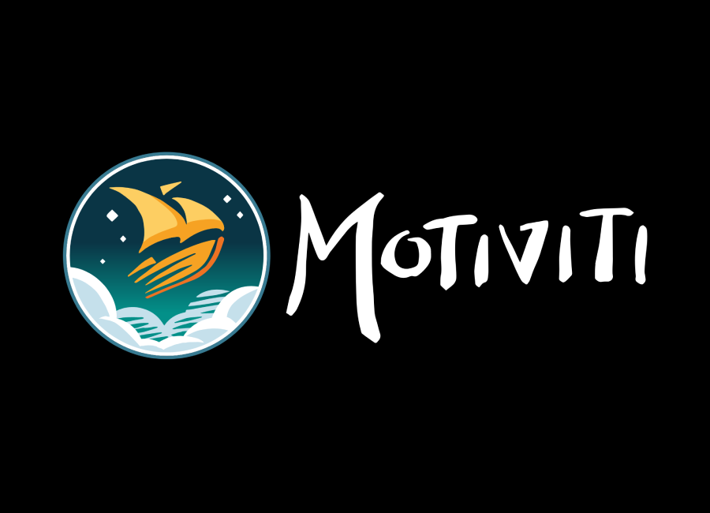
    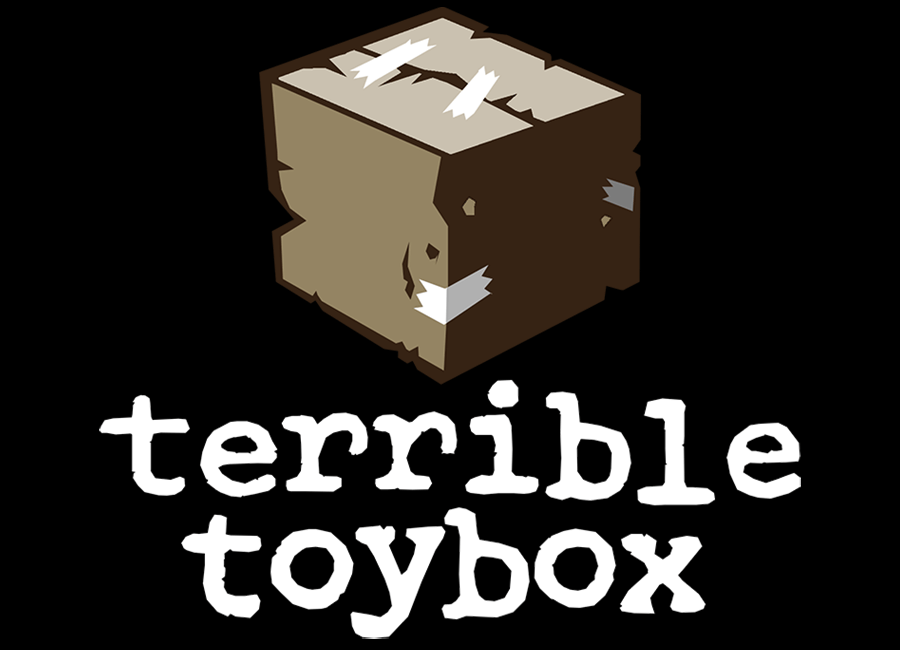
    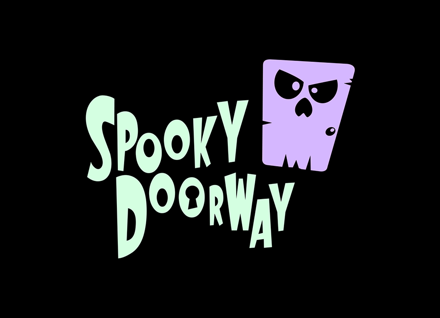
    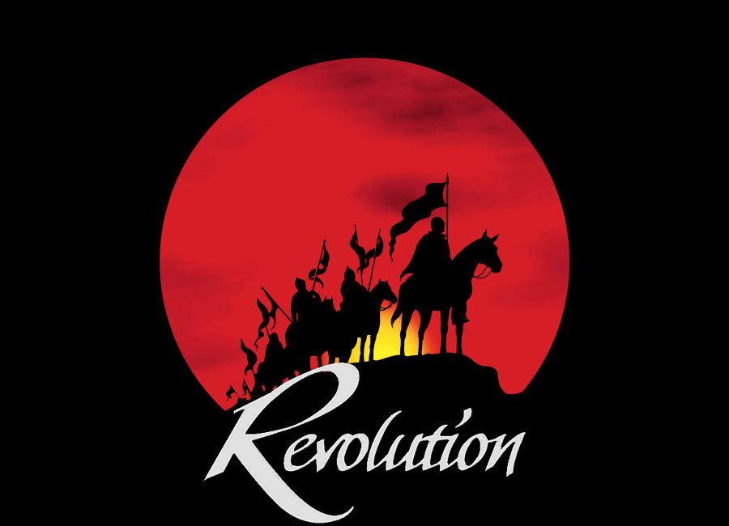
    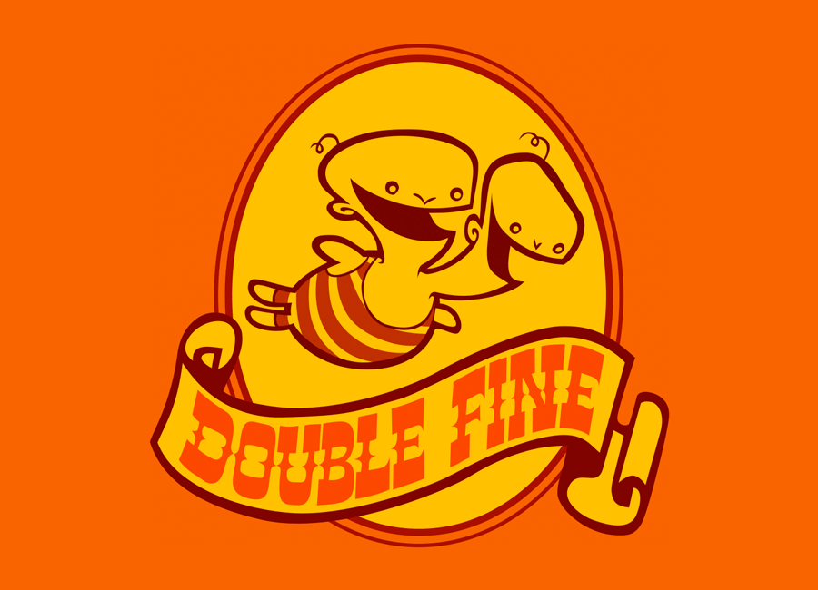
    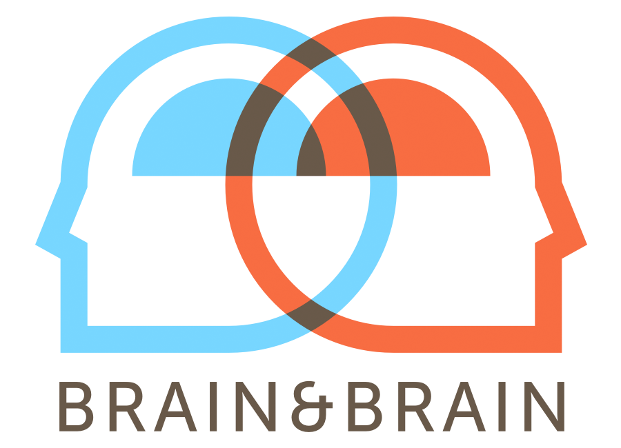
    
    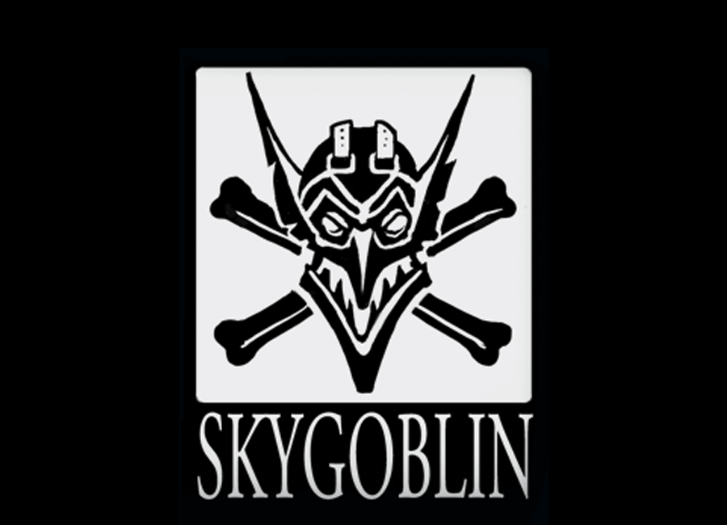
    
    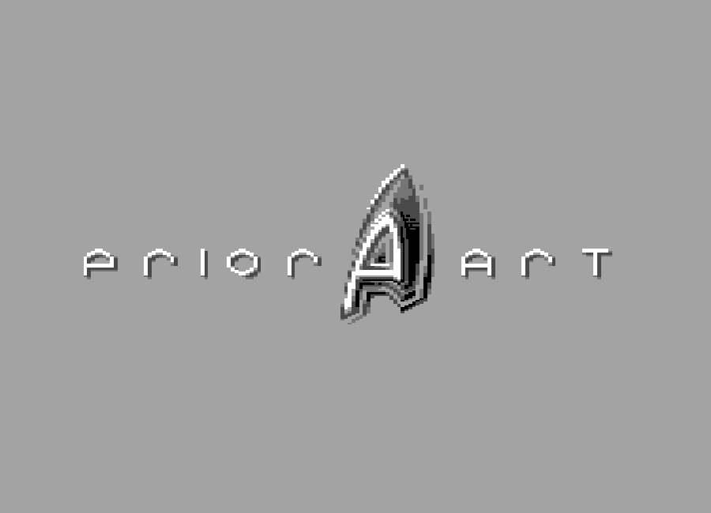
    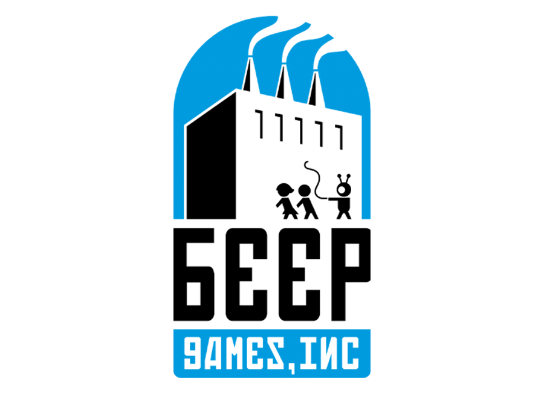
    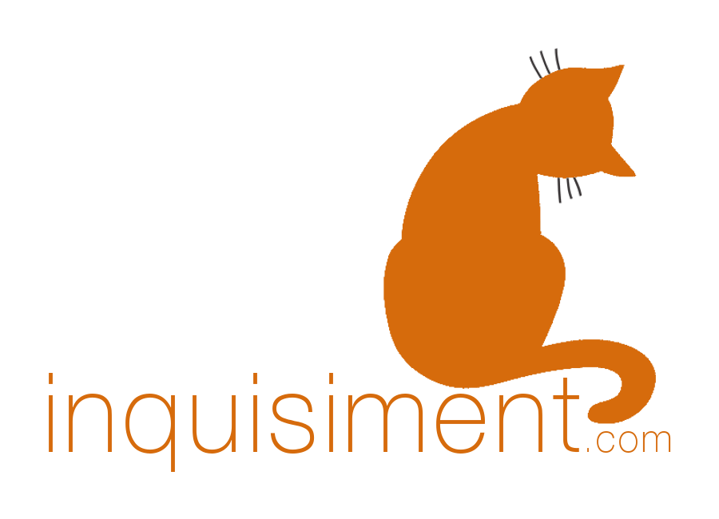
    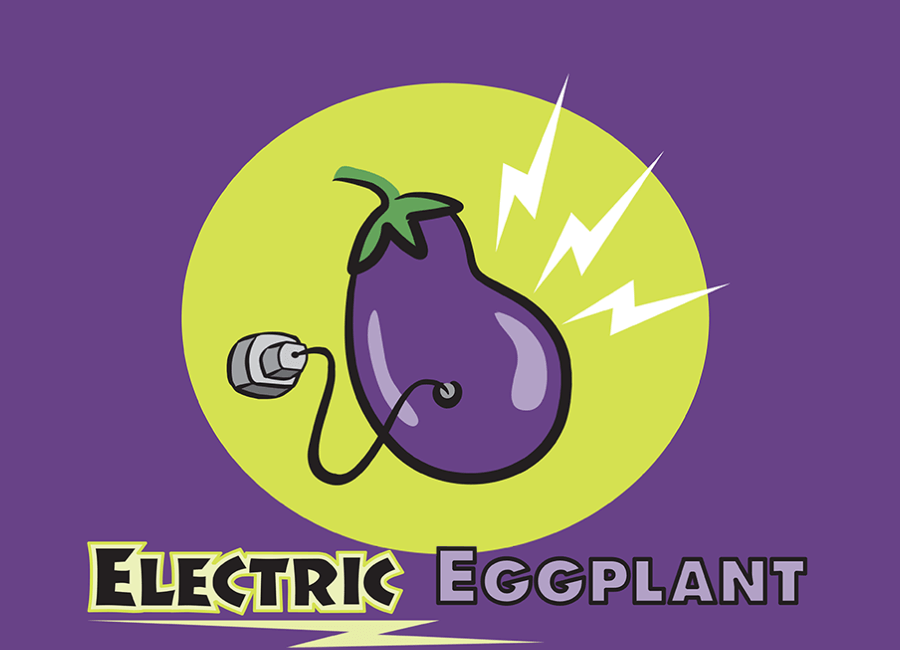
    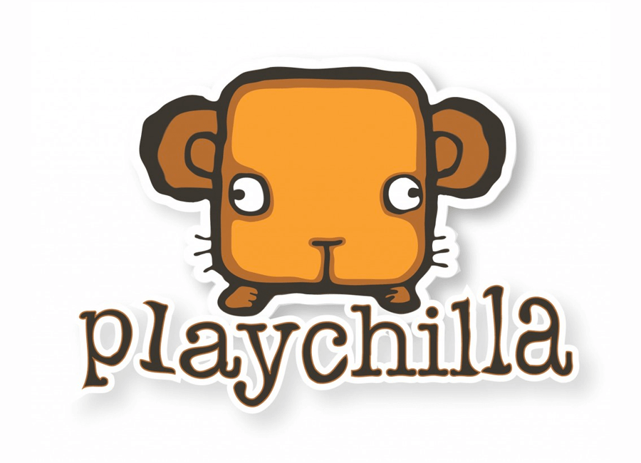
  

  <h3 align="center">Let's Connect</h3>
  

    I'm always open to new opportunities or collaborations. Feel free to reach out via   

     or
    
  

  

  <h3 align="center">Open Source Contributions</h3>
  <ul align="left" style="display: inline-block; text-align: left;">  
  <strong>ScummVM:</strong>
    <li>Early reverse engineering and reimplementation of callbacks for Teenagent engine.</li>
    <li>Reimplementation of title screens for Maniac Mansion (NES)</li>
    <li>Reimplementation of SCUMM engine Playback feature(used in the DOS Monkey Island 2 Demo)</li>
    <li>Implemented SQUASH decompression algorithm and MOD playback support for Simon the Sorcerer (Acorn)</li>
    <li>Implemented music driver and playback for music in Elvira 1 and 2 (Atari ST)</li>
    <li>Implemented a standalone tool to extract ScummVM compatible datafiles from Simon the Sorcerer disk images (Acorn)</li>
     
    <strong>WIP:</strong>
    <li>Reverse engineering and reimplementation of a ScummVM engine for Scooby Doo Mystery (Sega Genesis)</li>
    <li>Implementing EGA support for Elvira 1 and 2(DOS)</li>
  </ul>
  

    
  

